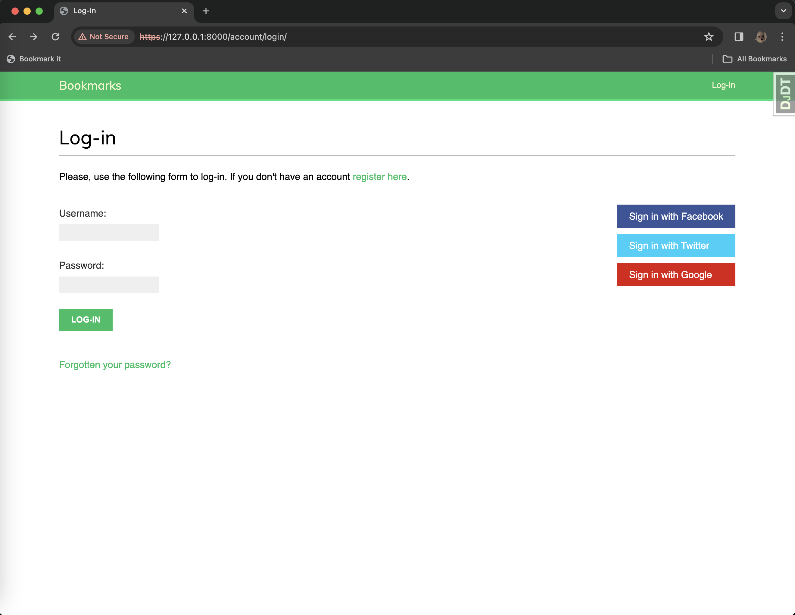
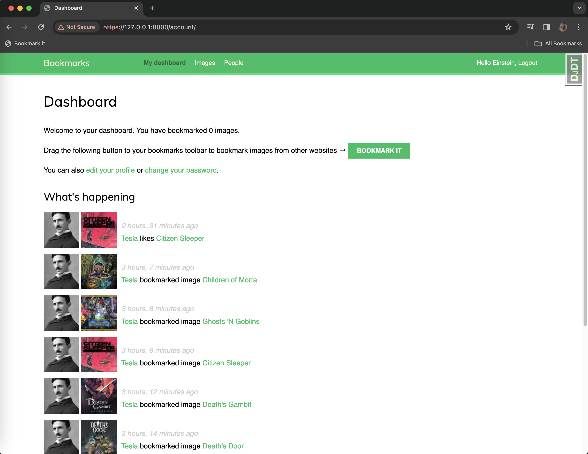
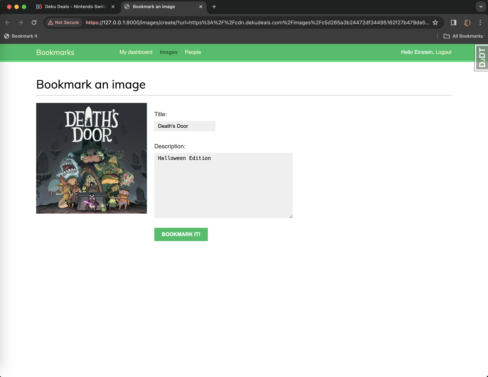
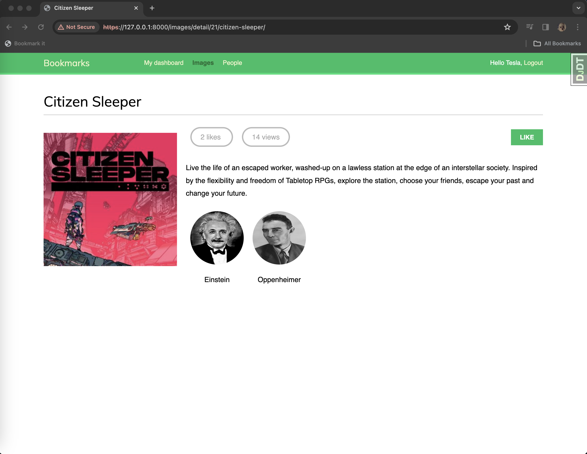
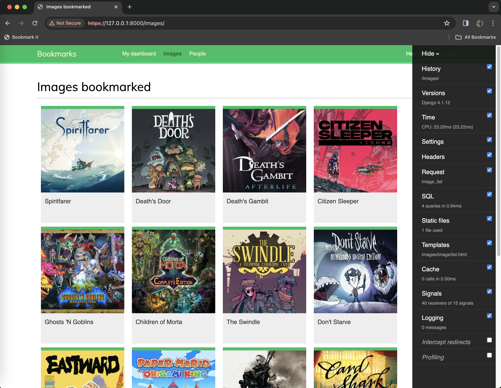
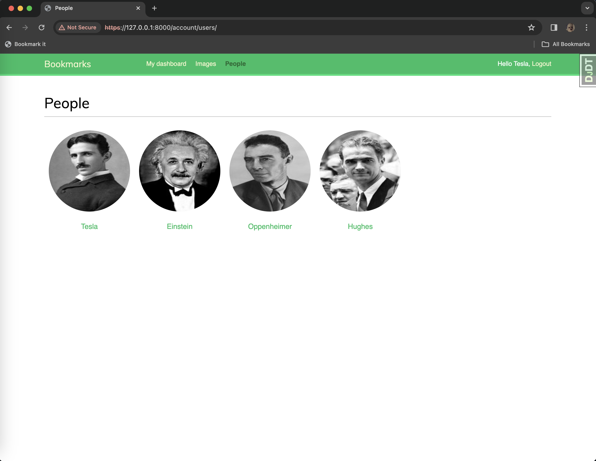
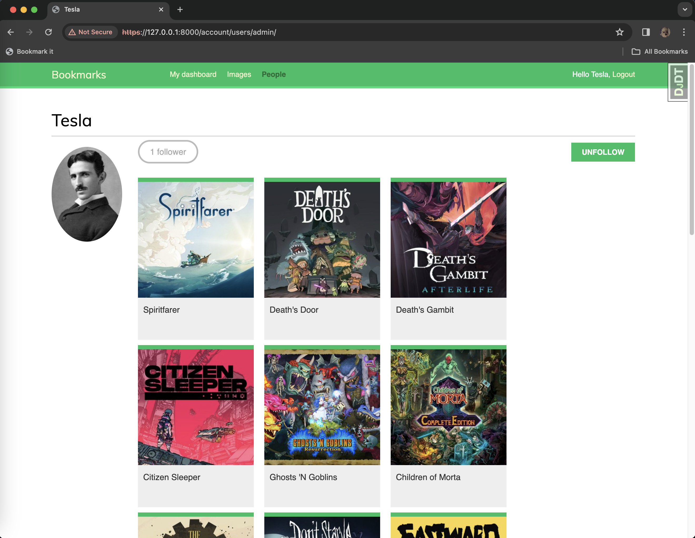
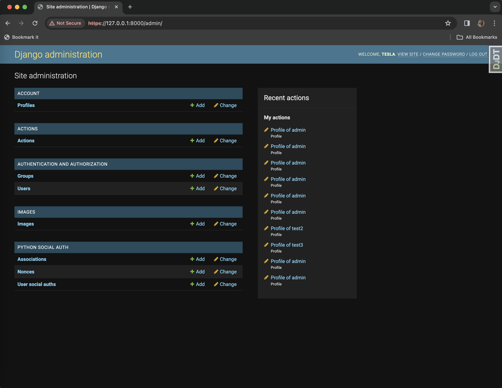

# bookmarks

This is the code repository for a social website utilizing the Django framework.

## Instructions

The code is organized into directories and it has a `requirements.txt` file that includes all packages required to run the application. These can be installed with the command `pip install -r requirements.txt`.

## About the Project

**bookmarks** serves as my deliberate practice while guiding me through the entire process of developing professional web applications with Django. This application not only covers the most relevant aspects of the framework, but it also shows how to integrate other popular technologies into a Django project.

The code walks through the creation of a real-world application, solving common problems, and implementing best practices, using a step-by-step approach that is easy to follow.

After completing this project, it has given me a good understanding of how Django works and how to build practical, advanced web applications.

## Requirements

This project requires Python 3.10+ and Django 4.1.

## Django Project

This exercise covers a wide range of web app development topics as specified below:

- **Social Website** : A website to bookmark and share images

  - Implemented authentication using the Django authentication framework
  - Extended the user model with a custom profile model
  - Used the Diango messages framework
  - Built a custom authentication backend
  - Implemented social authentication (OAuth2) with Facebook, Twitter, and Google using [Python Social Auth](https://github.com/python-social-auth/social-app-django)
  - Used [django-extensions](https://github.com/django-extensions/django-extensions) to run the development server through HTTPS
  - Generated image thumbnails with [easy-thumbnails](https://github.com/SmileyChris/easy-thumbnails)
  - Implemented many-to-many relationships in models
  - Built a JavaScript bookmarklet with JavaScript and Django
  - Added asynchronous HTTP requests with the JavaScript Fetch API and Django
  - Implemented infinite scroll pagination
  - Built a user follow system
  - Created a user activity stream and optimized QuerySets
  - Learned to use Django signals
  - Used [django-debug-toolbar](https://github.com/jazzband/django-debug-toolbar) to obtain relevant debug information
  - Counted image views with [Redis](https://redis.io/)
  - Built an image ranking with Redis

#### login with social authentication

#### dashboard

#### Bookmark it bookmarklet

#### bookmark an image

#### image detail page

#### images bookmarked

#### user list page

#### user detail page

#### admin page

